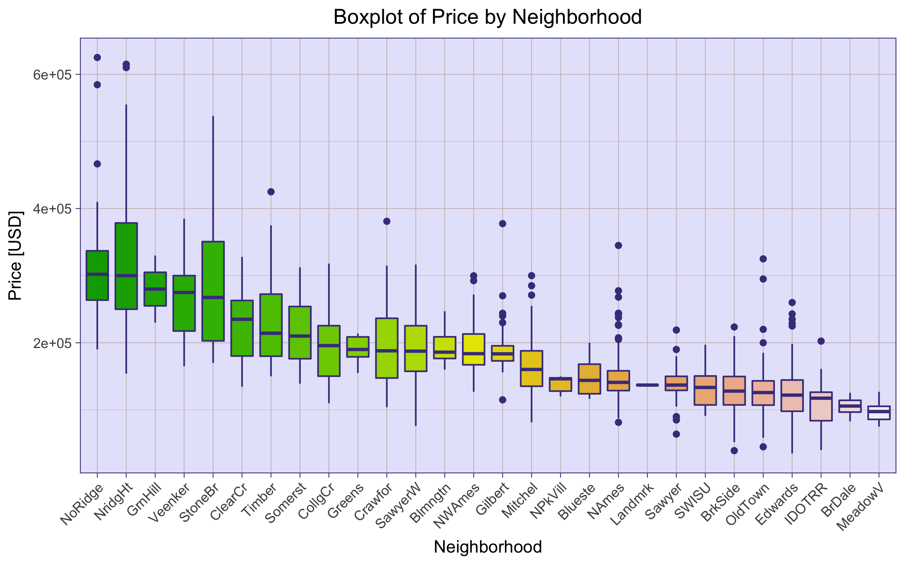
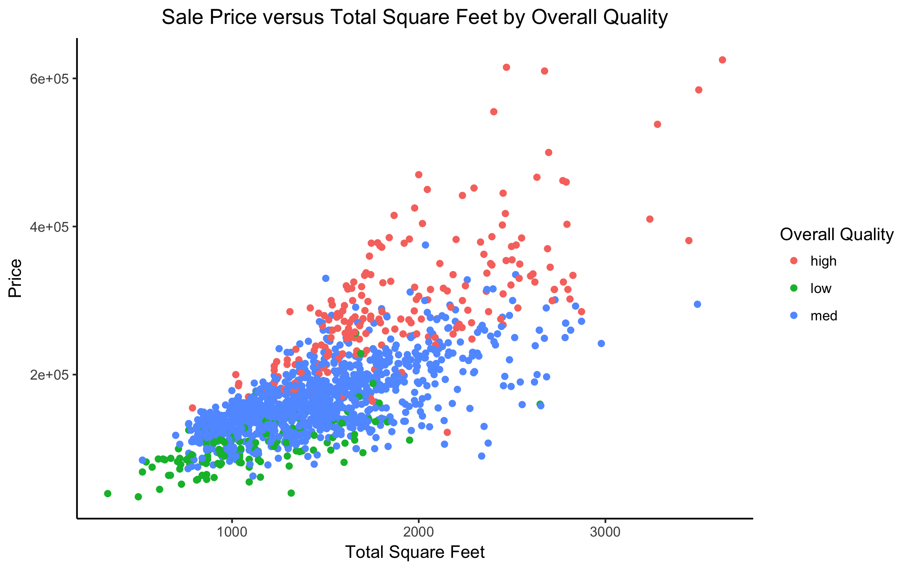
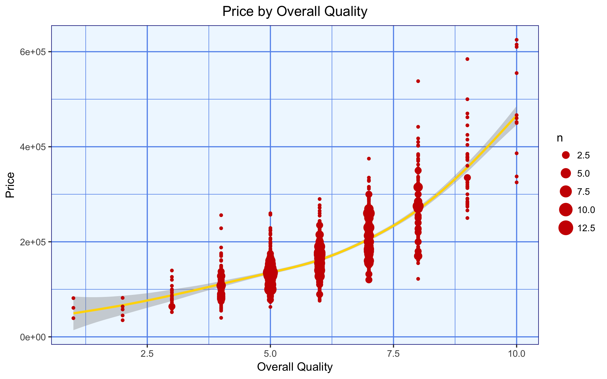

Stat 521 Final Project: homoBayesians
========================================================
author: Thomas Fleming, Eden Huang, Blaire Li, Marc Ryser
date: May 1, 2017 
autosize: true
font-family: 'Helvetica'

Price By Neighborhood and By "Near Campus"
========================================================
title:false

Price by "Near Campus" and by Total Square Feet and Quality
=========================================================
title:false

Plot 2: The difference in prices (or lackethereof) between houses close to campus and those further away.
***

Plot 3: The change in prices with respect to total square footage, stratified by overall quality.
Visualizations Rejected by the Group
=========================================================
title:false

Plot 4: Treemap of Total Square Footage, Binned by Listed Price
***

Plot 5: Price by Overall Quality

Model Results and Why Its The Best
==========================================================
- <small>The most important strategies for finding our simple and complex models involved:</small>
  - <small>scrupulous data cleaning using dplyr and tidyr</small> 
  - <small>using a stepwise function with BIC to narrow down the number of variables</small>
  - <small>using a boosted tree for relative variable importance to bring our number of variables under 20 for our final simple model</small>
  - <small>utilizing a pruned decision tree to show us relevant interactions and,</small>
  - <small>again using a stepwise function with BIC to arrive at our final complex model</small>
- <small>Results using a linear model with transformations and appropriate interactions on test set:</small>

|      bias|  max.dev| mean.dev|    RMSE| Coverage|
|---------:|--------:|--------:|-------:|--------:|
| -156.1364| 64352.67| 11229.45| 14983.7|    0.966|

Insights Into Predicting Sales Price
==========================================================
- According to our complex model, the most significant predictors included: 
log(Lot.Area), log(Total.Bsmt.SF), Overall.Cond, Baths, log(TotalSq), Bsmt.QualTA, Bsmt.QualGd, Bsmt.QualFa, Bsmt.QualEx, Condition.1Feedr, Kitchen.AbvGr, FoundationPConc, NeighborhoodGrnHill, Fireplaces, Kitchen.Qual, Bsmt.QualPo, and FoundationCBlock.
- According to our boosted tree, the features with the highest relative importance included Overall Quality, logged Total Square Footage, and Neighborhood.
- Despite our initial beliefs, proximity to Iowa State's campus did not seem to be a factor in determining list price.

Two Houses to Purchase
==========================================================

|       PID|  price| price_to_pred_ratio| TotalSq| Overall.Qual|Neighborhood |
|---------:|------:|-------------------:|-------:|------------:|:------------|
| 527182020| 130000|           0.7556536|    1204|            8|StoneBr      |
| 534479120| 105000|           0.8349797|    1376|            5|NAmes        |

- <small>The two houses we recommend purchasing are in the Stone Bridge and North Ames neighborhoods, respectively.</small> 
  - <small>Both in our top 10 underpriced houses; both below the median housing price for that neighborhood</small>
  - <small>Both of reasonable size in square footage, falling in the middle to low end, relatively speaking.</small>
  - <small>Overall Quality of 8 and 5, respectively. Could see a big uptick in price with some remodeling to the latter, as we saw in our graph that this uptick generally happens around the 7.5 quality mark.</small>
  
Team Name and Graphic
==========================================================
- Our team name- homoBayesians- was created as a pun on Homo Sapiens, written in camel case (due to subjective preference). Our team graphic can be [viewed here] (https://files.slack.com/files-pri/T3Y4U2EF8-F51M8HB2S/bayesian_evol.png).
