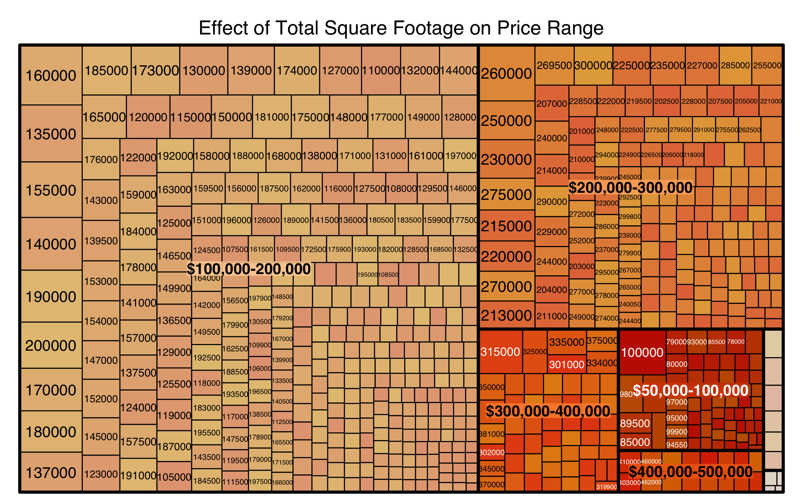

Stat 521 Final Project by: homoBayesians
========================================================
author: Thomas Fleming, Eden Huang, Blaire Li, Marc Ryser
date: May 1, 2017 
autosize: true

Price By Neighborhood
========================================================
title: false

Price By Total Square Footage and Overall Quality
========================================================
title:false

Visualizations Rejected by the Group
=========================================================
title:false

Rejected Graphic
==========================================================
title:false

(Statisticians do it with) Models
==========================================================
- The explanatory variables for our simple model included log(Lot.Area), Neighborhood, Condition.1, Overall.Qual, Overall.Cond, HouseAge, Foundation, Bsmt.Qual, Bsmt.Exposure, log(Total.Bsmt.SF), Central.Air, Baths, Kitchen.AbvGr, Kitchen.Qual, Functional, Fireplaces, Garage.Cars, Paved.Drive, log(TotalSq)
- The explanatory variables for our complex model, complete with interactions, included log(Lot.Area), Condition.1, Overall.Qual, Baths, Neighborhood, Garage.Cars, log(Total.Bsmt.SF), log(TotalSq), Overall.Cond, HouseAge, Foundation, Bsmt.Qual, Bsmt.Exposure, Heating.QC, Central.Air, Bedroom.AbvGr, Kitchen.AbvGr, Kitchen.Qual, Functional, Fireplaces, Paved.Drive, Overall.Qual:Garage.Cars, Overall.Qual:log(TotalSq), Garage.Cars:log(TotalSq), Overall.Qual:Garage.Cars:log(TotalSq)
- And of course, we logged our response variable.

===========================================================

The End

